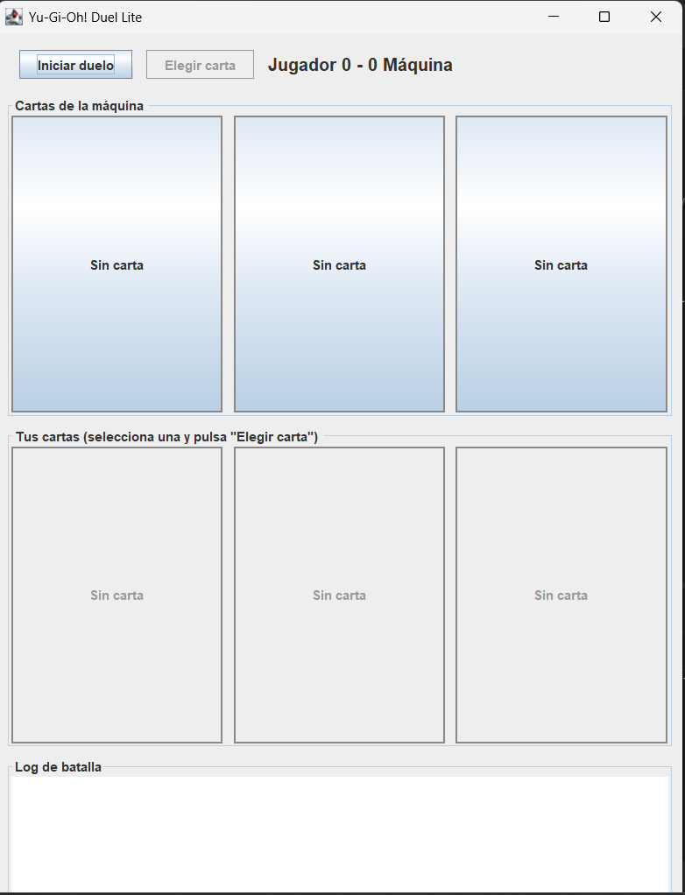
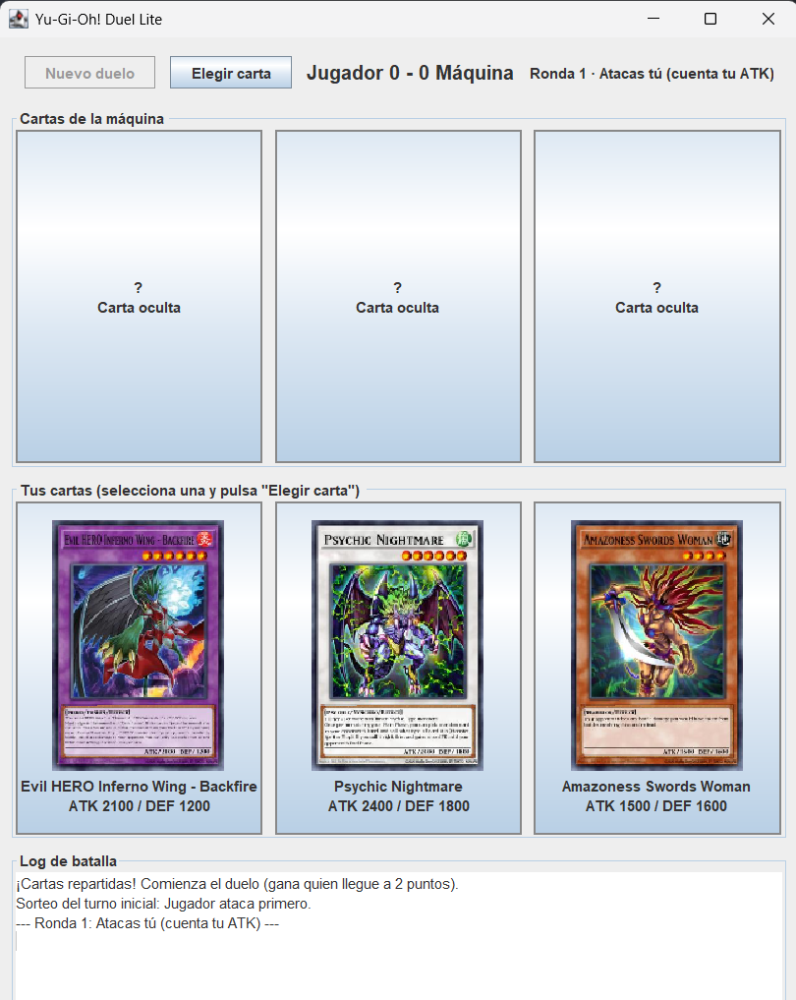
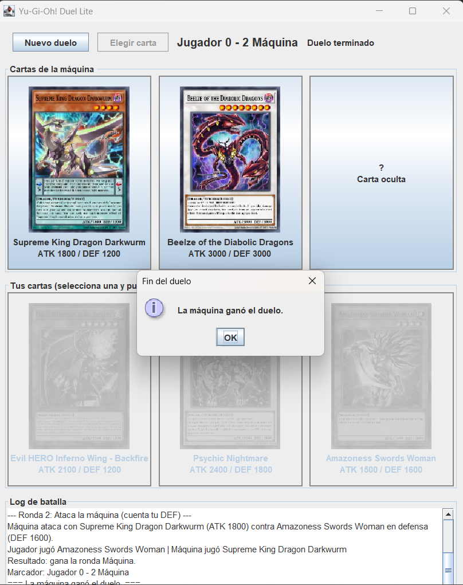

# Yu-Gi-Oh! Duel Lite — Laboratorio 1 (DDS3)

## Participantes

| Nombre | Código |
|---|---|
| Gustavo Restrepo | 2380618-3743 |
| Santiago Velasquez Bedoya | 2380378-3743 |

Mini-aplicación de escritorio en Java Swing que simula un duelo de Yu-Gi-Oh! entre el jugador y la máquina, con cartas Monster obtenidas en vivo desde la API [YGOProDeck](https://db.ygoprodeck.com/api-guide/).

## Ejecución

**Requisitos:** JDK 11 o superior y conexión a internet.

### IntelliJ IDEA

1. `File → Open` y seleccionar la carpeta del repositorio.
2. Si lo pide, asignar un JDK 11+ en `File → Project Structure → Project → SDK`.
3. Ejecutar la configuración **Main** (o la clase `co.edu.univalle.ygo.Main`).

La librería `org.json` ya viene en `lib/` y está configurada como librería del proyecto.

### Línea de comandos

```bash
javac -encoding UTF-8 -cp lib/json-20250517.jar -d out $(find src -name '*.java')
java -cp out:lib/json-20250517.jar co.edu.univalle.ygo.Main
```

(En Windows usar `;` en lugar de `:` en el classpath.)

## Cómo se juega

1. Pulsa **Iniciar duelo**: se cargan 3 cartas Monster para ti y 3 para la máquina.
2. Un sorteo define quién ataca en la primera ronda; después el atacante se alterna.
3. Selecciona una de tus cartas y pulsa **Elegir carta**. La máquina responde con una carta al azar.
4. La carta del atacante va en ataque y la del rival en defensa: se compara el **ATK del atacante contra la DEF del defensor**. El mayor valor gana la ronda; si son iguales, nadie suma punto.
5. Cada carta se usa una sola vez. Gana el primero en llegar a **2 puntos**. Si se acaban las cartas antes, gana quien tenga más puntos, y con igual puntaje el duelo queda empatado.

## Diseño

El código está dividido en cuatro paquetes con responsabilidades separadas: `model` (`Card`, `Position`) contiene los datos; `api` (`YgoApiClient`) consulta `randomcard.php` con `java.net.http.HttpClient`, parsea el JSON con `org.json` y repite la petición hasta obtener una carta de tipo Monster; `logic` (`Duel`) aplica las reglas del duelo sin depender de Swing; y `ui` (`DuelFrame`, `CardView`) muestra el tablero, el marcador y el log de batalla.

`Duel` se comunica con la interfaz únicamente mediante la interfaz `BattleListener` (`onTurn`, `onScoreChanged`, `onDuelEnded`, más `onRoundStarted` y `onCardsPlayed` como eventos opcionales), lo que desacopla la lógica de la vista. Las peticiones HTTP y la descarga de imágenes se hacen dentro de un `SwingWorker`, de modo que el hilo de eventos de Swing nunca se bloquea; el duelo solo empieza cuando las 6 cartas están cargadas, y los errores ("Error de red", "No se pudo cargar la carta") se muestran en un diálogo, en la barra de estado y en el log.

## Capturas de pantalla

### Pantalla inicial



### Cartas obtenidas al azar



### Duelo en curso

